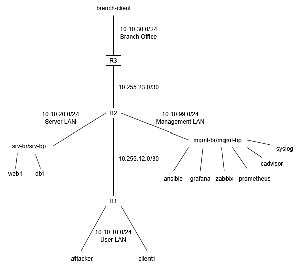

<Markdown>

# Viikko 1 - Verkon dokumentointi


## 1. Johdanto

Tämä harjoitusympäristö on virtuaalinen verkkoympäristö, jota käytetään verkonhallinnan opetteluun. Ympäristössä on  reitittimiä, palvelimia, eri verkkoja ja päätelaitteita. Kurssilla opetellaan käyttämään verkonhallinnan työkaluja, sekä dokumentoimaan verkkoa ja verkonhallintaa.


## 2. Verkkokaavio


## 3. Laiteluettelo
| Laite | Tehtävä |
|---|---|
| R1 | Reititin - yhdistää User LANin muuhun verkkoon |
| R2 | Reititin - yhdistää eri verkkoja |
| R3 | Reititin - yhdistää Branch Officen muuhun verkkoon |
| Client1 | User LANin päätelaite |
| Attacker | User LANin hyökkääjä-päätelaite |
| Web1 | Web-palvelin |
| Db1 | Tietokantapalvelin |
| Branch-client | Branch Officen päätelaite |
| Ansible | Automatisointiin käytettävä palvelin |
| Prometheus | Valvontatiedon keräys-palvelin |
| Grafana | Valvontatiedon visualisointi-palvelin |
| Zabbix | Verkkovalvonnan palvelin |


## 4. IP-suunnitelma

| Verkko | Tarkoitus | Yhdyskäytävä | Laitteet |
|---|---|---|---|
| 10.10.10.0/24 | User LAN | 10.10.10.1 (R1) | client1, attacker |
| 10.10.20.0/24 | Server LAN | 10.10.20.1 (R2) | web1, db1 | 
| 10.10.30.0/24 | Branch Office | 10.10.30.1 (R3) | branch-client  |
| 10.10.99.0/24 | Management LAN | 10.10.99.1 (R2) | ansible, prometheus, syslog, cadvisor, grafana, zabbix |
| 10.255.12.0/30 | R1–R2 yhteys | R1: 10.255.12.1, R2: 10.255.12.2 | R1, R2 |
| 10.255.23.0/30 | R2–R3 yhteys | R2: 10.255.23.1, R3: 10.255.23.2 | R2, R3 |


## 5. Reitityksen analyysi

Client1:n IP-osoite User LANissa on 10.10.10.101 ja oletusyhdyskäytävä on 10.10.10.1 , eli R1:sen interface User LANiin.. Liikenne muihin verkkoihin kulkee R1:n kautta.


```text
root@client1:/# ip route
default via 10.10.10.1 dev eth1
10.10.10.0/24 dev eth1 proto kernel scope link src 10.10.10.101
172.20.20.0/24 dev eth0 proto kernel scope link src 172.20.20.9
```

### Ping Web1:lle

```text
root@client1:/# ping -c 4 10.10.20.101
PING 10.10.20.101 (10.10.20.101) 56(84) bytes of data.
64 bytes from 10.10.20.101: icmp_seq=1 ttl=62 time=0.150 ms
64 bytes from 10.10.20.101: icmp_seq=2 ttl=62 time=0.084 ms
64 bytes from 10.10.20.101: icmp_seq=3 ttl=62 time=0.086 ms
64 bytes from 10.10.20.101: icmp_seq=4 ttl=62 time=0.065 ms

--- 10.10.20.101 ping statistics ---
4 packets transmitted, 4 received, 0% packet loss, time 2997ms
```
Ping onnistui, mikä todistaa toimivan yhteyden Client1:ltä Web1-palvelimelle.


### Ping Branch-clientille

```text
root@client1:/# ping -c 4 10.10.30.101
PING 10.10.30.101 (10.10.30.101) 56(84) bytes of data.
64 bytes from 10.10.30.101: icmp_seq=1 ttl=61 time=0.143 ms
64 bytes from 10.10.30.101: icmp_seq=2 ttl=61 time=0.072 ms
64 bytes from 10.10.30.101: icmp_seq=3 ttl=61 time=0.070 ms
64 bytes from 10.10.30.101: icmp_seq=4 ttl=61 time=0.081 ms

--- 10.10.30.101 ping statistics ---
4 packets transmitted, 4 received, 0% packet loss, time 3003ms
```
Ping onnistui, joten yhteys toimii myös Branch-clientille.


### Traceroute

```text
root@client1:/# traceroute 10.10.30.101
traceroute to 10.10.30.101 (10.10.30.101), 30 hops max, 60 byte packets
1  10.10.10.1 (10.10.10.1)
2  10.255.12.2 (10.255.12.2)
3  10.255.23.2 (10.255.23.2)
4  10.10.30.101 (10.10.30.101)
```

Traceroutesta selviää, että  Reitti on Client1 → R1 → R2 → R3 → Branch-client.


## 6. Yhteenveto


Useat tämän kurssin ohjelmat ja ympäristöt olivat minulle täysin uusia. Käsitteiden ja termien sisäistämiseen meni aikaa. Kokonaisuuden hahmottaminen, miksi tehdään, mitä tehdään. Kurssiympäristön pystyttäminenkin vei aika paljon aikaa. Sitten kun kurssiympäristö oli valmis, niin hommat alkoi paremmin rullaamaan, kun asia oli taas tutumpaa verkkotekniikkaa. 

Tällainen dokumentaatio auttaa erittäin paljon IT-palvelun omistajaa. Kaavioista ja taulukoista on helppo nähdä, mitä verkossa oikeasti on. On myös todella paljon luotettavampaa säilyttää tietoa yhdessä paikassa, ja sitä on myös tarpeen mukaan mahdollista päivittää. 

Tehtävässä on käytetty tekoalyä juurikin oppimisen tukemisessa, kokonaiskuvan hahmottamisessa, ja esimerkiksi Markdownin opettelussa, joka oli itselleni aivan uusi aihe.
