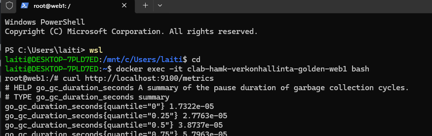
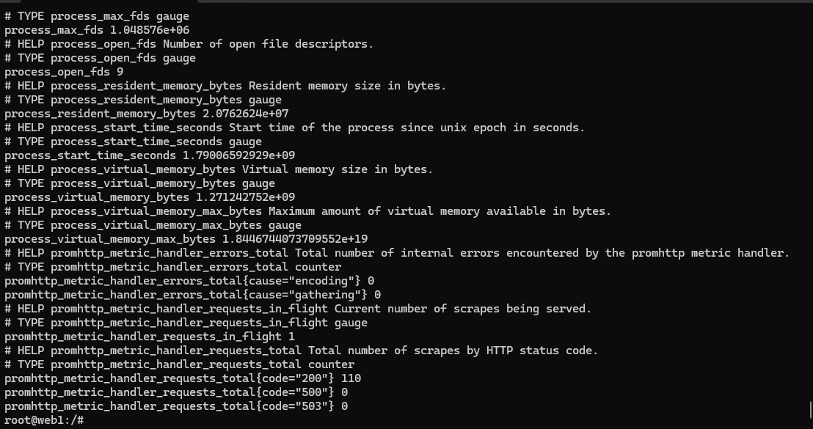
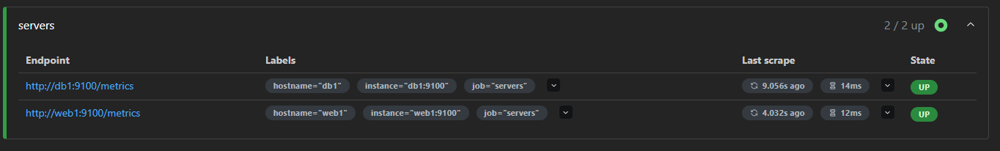
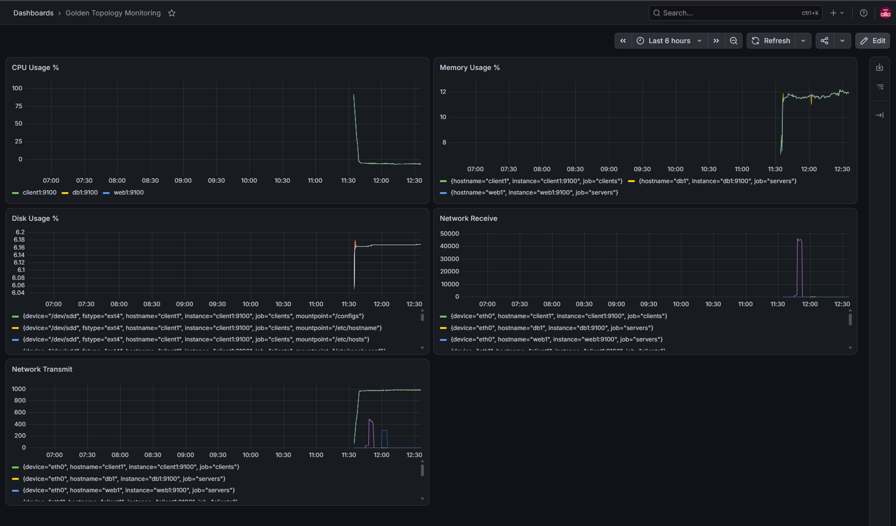
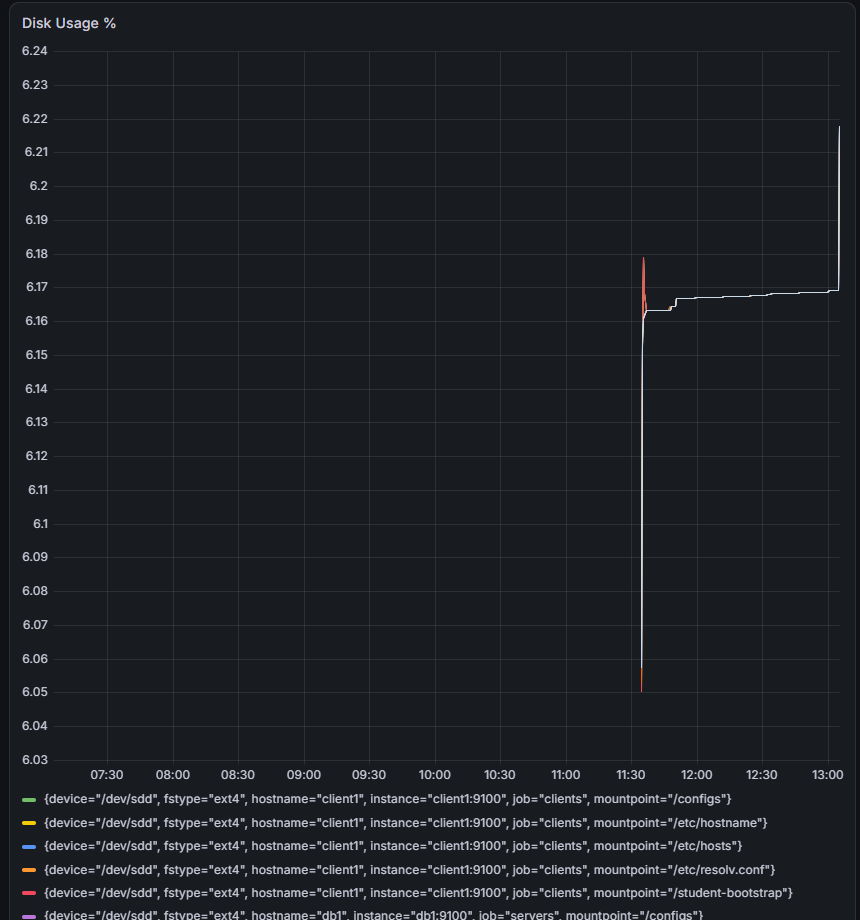
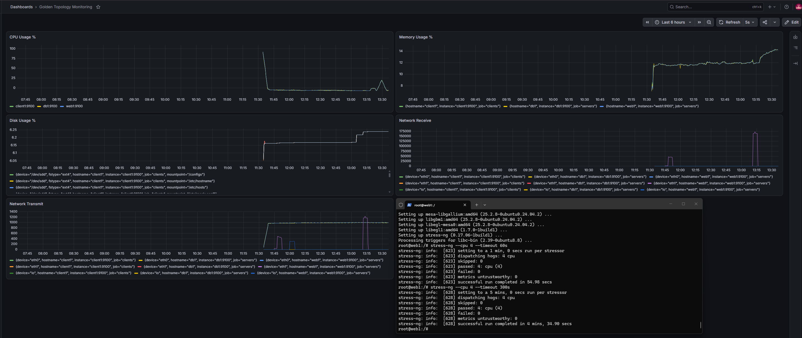

# Viikko 3 - Prometheus, Node Exporter ja Grafana


## 1. Johdanto

Prometheus-monitorointi toimii niin, että ensin asennentaan Node Exporter, joka kerää ja tarjoaa metriikoita Prometheukselle. Sitten Grafanalle määritellään lähteeksi Prometheus, jolloin Grafana visualisoi Prometheuksen keräämät tulokset.


## 2. Node Exporterin käyttöönotto

Ensin asennetaan työkalut.

```bash
root@web1:/# apt update
apt install wget tar -y
```

Ladataan Node Exporterin viimeisin versio.

```bash
root@web1:/# wget https://github.com/prometheus/node_exporter/releases/latest/download/node_exporter-1.12.1.linux-amd64.
tar.gz
```

Puretaan paketti.
```bash
root@web1:/# tar xvf node_exporter-*.linux-amd64.tar.gz
node_exporter-1.12.1.linux-amd64/
node_exporter-1.12.1.linux-amd64/node_exporter
node_exporter-1.12.1.linux-amd64/LICENSE
node_exporter-1.12.1.linux-amd64/NOTICE
```
Mennään purettuun hakemistoon node_exporter-1.12.1.linux-amd64, ja käynnistetään Node Exporter komennolla : ./node_exporter.
```bash
root@web1:/# cd node_exporter-1.12.1.linux-amd64
root@web1:/node_exporter-1.12.1.linux-amd64# ./node_exporter
```

Avataan toinen terminaali ja testataan tuolla curl-komennolla Node Exporterin toimintaa.



Kuvassa pieni osa metriikkatulosteesta:


## 3. Prometheus

Avataan selaimessa http://localhost:9090. Valitaan Status --> Targets ja varmistetaan, että web1 näkyy kohteena, sekä tila on UP.



## 4. Dashboard

Kuva dashboardista ennen testausta:


## 5. Kuormitustesti

Aiheutetaan levykuormitusta web1-palvelimelle komennolla: 
```bash
dd if=/dev/zero of=testfile.img bs=1M count=500
```

Grafanan kuvaajasta näkee selvästi levytilan kuormituksen kasvun:



CPU-kuormituksessa kokeillaan ensin komentoa seuraavalla stressitestillä:
```bash
sudo apt install stress-ng
stress-ng --cpu 4 --timeout 60s
```
Nousu kuvaajalla oli kuitenkin aika pieni, niin kokeillaan nostaa testin aikaa 300s. Tämä tuottaa jo selvän piikin CPU-kuvaajassa.


Myös muistinkäytössä havaittavissa kasvua testin aikana. Verkkoliikenteessä selvä piikki johtuen stress-ng-latauksesta. CPU-kuormitustesti ei itsessään vaikuttanut verkkoliikenteeseen.

## 6. SNMP vs Prometheus

| Ominaisuus | SNMP | Prometheus |
|---|---|---|
| Tiedonkeruu | Perustuu agentin kyselyihin | Hakee Exporterilta metriikkaa |
| Käyttöönotto | SNMP agentin asennus | Node Exporter, Prometheus ja Grafana asennukset |
| Mittarien määrä | OID/MIB | Paljon metriikkaa |
| Visualisointi | Ei varsinaista | Grafanalla kuvaajat |
| Hälytysmahdollisuudet | SNMP trapit | Alertmanager |
| Soveltuvuus pilviympäristöihin | Soveltuu, mutta enemmän käytössä verkkolaitteissa | Hyvä soveltuvuus pilviympäristöihin |

## Pohdinta

Prometheuksella voidaan kerätä paljon erilaisia mittareita automaattisesti ja seurata niiden muutoksia myös pitkällä aikavälillä. Grafanan avulla tiedot saadaan myös helposti visuaaliseen muotoon.

Ylläpitäjän kannattaa seurata esimerkiksi CPU:n ja muistin käyttöä, levytilaa sekä verkkoliikennettä. Näistä voidaan havaita resurssien loppuminen tai poikkeava kuormitus.

Lisäisin dashboardiin tiedon siitä, ovatko seurattavat palvelimet tavoitettavissa.

Monitorointitiedosta voidaan nähdä, milloin ongelma on alkanut ja mitä järjestelmässä tapahtui samaan aikaan.

## 7. Yhteenveto

 Harjoitus oli erittäin mielenkiintoinen. Juuri Grafanan kuvaajat tekivät harjoituksesta hyvin konkreettisen ja havainnollistavan. Tässä kohtaa alkaa hahmottumaan selkeämmin, kuinka metriikkaa kerätään ja miten se yhdistetään selkeästi ihmiselle hahmotettavaksi visuaaliseksi kuvaajaksi. 

