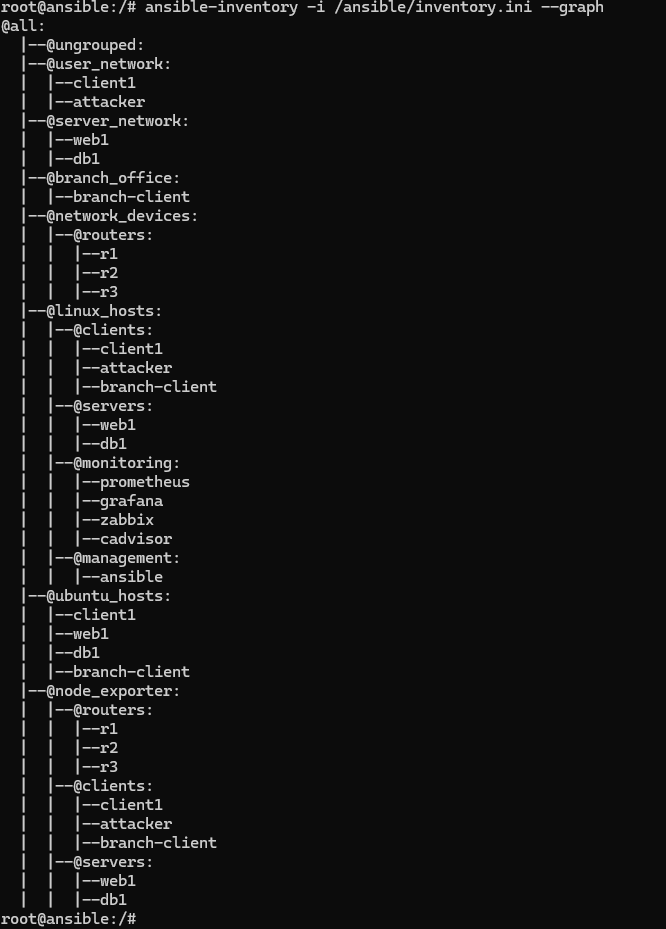
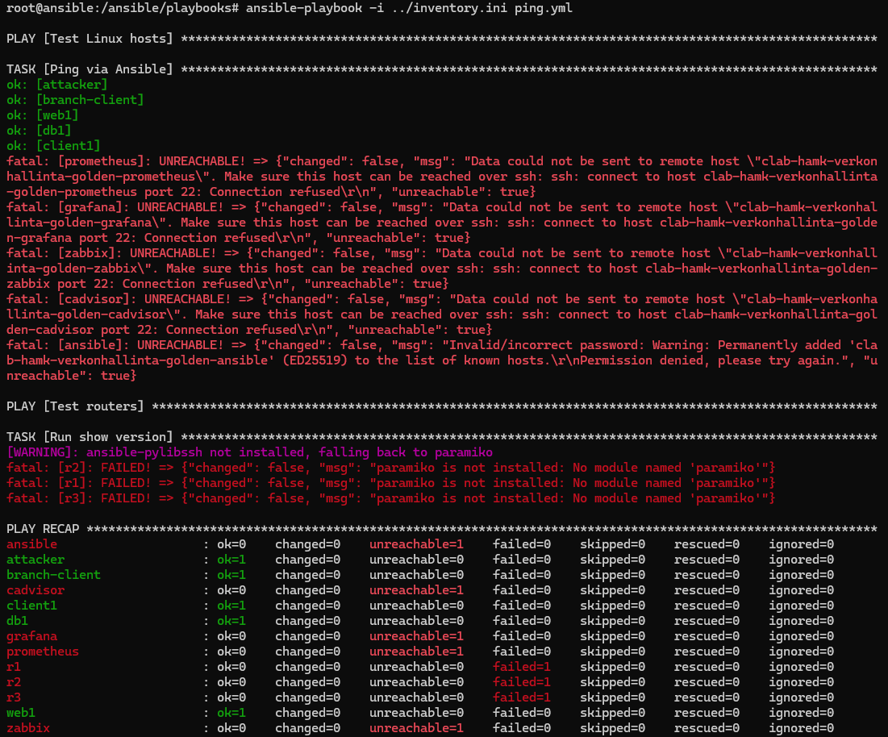
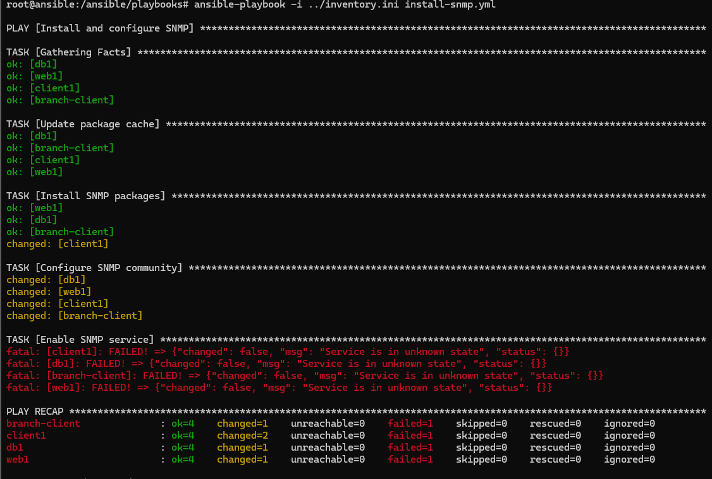
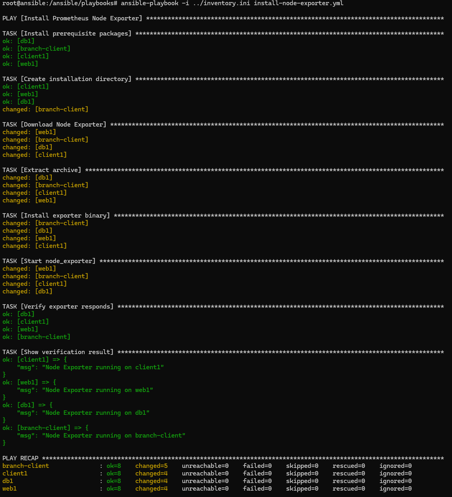

# Viikko 4 - Ansible ja Infrastructure as Code

## 1. Johdanto

Infrastructure as Code (IaC) tarkoittaa hallintaa ohjelmakoodin avulla. Tämä mahdollistaa hallinnan automatisoinnin, sekä hallinnan useille laitteille samanaikaisesti. Ja kun ympäristö luodaan koodista, on sen uudelleenluonti mahdollista milloin tahansa. 

Hallinta koodilla mahdollistaa nopeat muutokset ja tehokkaamman työn, vähemmän virheitä, paremman skaalautuvuuden ja ketteryyttä, sekä lisää näkyvyyttä, tietoturvaa ja jäljitettävyyttä. Toiminta perustuu siis koodilla päästävään haluttuun tavoitetilaan. 

Työkalu suorittaa muutokset API- tai SSH-yhteyksien kautta mahdollistaen agentittoman hallinnan. Tässä tehtävässä käytetään Ansiblea virtuaaliympäristön hallintaan ja tehtävien automatisointiin.

## 2. Inventory

Inventory sisältää tiedot kaikista Ansiblen hallitsemista kohteista. Inventory kertoo Ansiblelle mitä kohteita hallitaan, mihin ryhmään kohteet kuuluvat sekä miten niihin yhdistetään. Yksi kohde voi kuulua useampaan ryhmään. Ryhmillä voidaan mahdollistaa tehokas hallinta niin, että saadaan automatisoitua juuri tiettyä joukkoa tietyillä määrittelyillä. Tässä virtuaaliympäristössä ryhmät on jaettu seuraavanlaisesti:

## 3. Esimerkkiplaybookit

### ping.yml

Ennen playbookin suorittamista yhteyksiä testattiin komennolla ansible all -i /ansible/inventory.ini -m ping. Testissä yhteys onnistui myös reitittimille R1–R3.

Ping.yml-playbook testaa Linux-hostien yhteydet ja yrittää lisäksi suorittaa reitittimillä show version -komennon. Linux-hosteista client1, attacker, branch-client, web1 ja db1 vastasivat onnistuneesti. Monitoring-palveluihin SSH-yhteys ei onnistunut. Show version -tehtävä reitittimille epäonnistui puuttuvan Paramiko-kirjaston vuoksi.Reitittimet olivat siis tavoitettavissa, mutta tehtävän suoritus epäonnistui (unreachable=0, failed=1) . Kuvassa näkyy tarkat tulokset:

### install-snmp.yml

Tässä playbookissa on tarkoitus asentaa automaattisesti SNMP-agentti. Playbook käyttää apt-moduulia pakettien päivittämiseen ja SNMP-pakettien asentamiseen, copy-moduulia SNMP-konfiguraation tekemiseen ja service-moduulia SNMP-palvelun käynnistämiseen. Lisäksi shell-moduulilla tarkistetaan SNMP-prosessin toiminta ja debug-moduulilla tulostetaan tarkistuksen tulos.

Määritellään muuttuja snmp_community: public. Muuttujaa käytetään SNMP-konfiguraatiossa muodossa {{ snmp_community }}, jolloin samaa arvoa voidaan käyttää helposti eri kohdissa ja tarvittaessa muuttaa yhdestä paikasta.

SNMP-playbookissa käytetään handleria restart snmpd. Konfiguraatiotiedoston muuttaminen lähettää notify-komennolla ilmoituksen handlerille, jolloin SNMP-palvelu käynnistetään uudelleen. Jos konfiguraatio ei muutu, uudelleenkäynnistystä ei tehdä turhaan.

Playbookin suorittamisessa SNMP-paketit olivat jo asennettuina web1-, db1- ja branch-client-koneille aikaisemman harjoituksen jäljiltä. Client1-koneelle Ansible asensi puuttuvat paketit. Tämä havainnollistaa Ansiblen idempotenssia, koska jo asennettuja paketteja ei asennettu uudelleen.

SNMP-palvelun käynnistäminen Ansiblen service-moduulilla epäonnistui virheeseen Service is in unknown state. Kokeilin web1-palvelimella tämän jälkeen aikaisemmassa harjoituksessa käytettyä komentoa service snmpd restart, jolla palvelu käynnistyi onnistuneesti. Tätä en alkanut enempää selvittämään. Ohessa kuva playbookin tulosteesta:

### install-node-exporter.yml

Playbook asentaa ja käynnistää Node Exporterin ubuntu_hosts-ryhmän koneille. Playbook käyttää apt-moduulia tarvittavien pakettien asentamiseen, file-moduulia asennushakemiston luomiseen, get_url-moduulia Node Exporterin lataamiseen, unarchive-moduulia paketin purkamiseen ja copy-moduulia ohjelmatiedoston kopioimiseen asennushakemistoon. shell-moduulilla Node Exporter käynnistetään ja uri-moduulilla tarkistetaan, että se vastaa portissa 9100. Lopuksi debug-moduulilla tulostetaan tarkistuksen tulos.

Määritellään muuttuja node_exporter_version: "1.9.1". Muuttujaa käytetään esimerkiksi latausosoitteessa ja tiedostopolussa. Version vaihtaminen onnistuu näin muuttamalla arvo vain yhdestä paikasta.

Node Exporter -playbookissa ei käytetä handleria, koska Node Exporter käynnistetään suoraan shell-moduulilla. Mahdollinen aikaisempi Node Exporter -prosessi lopetetaan ja uusi prosessi käynnistetään playbookin suorittamisen yhteydessä.

Playbook suoritus onnistui kaikille neljälle ubuntu_hosts-ryhmän koneelle. Node Exporterin toiminta tarkastettiin uri-moduulilla ja kaikki koneet vastasivat portissa 9100. Suorituksen lopussa kaikilla koneilla oli unreachable=0 ja failed=0. Ohessa kuva playbookin tulosteesta:

## 4. Oma playbook

## 5. Vertailu

## 6. Yhteenveto

